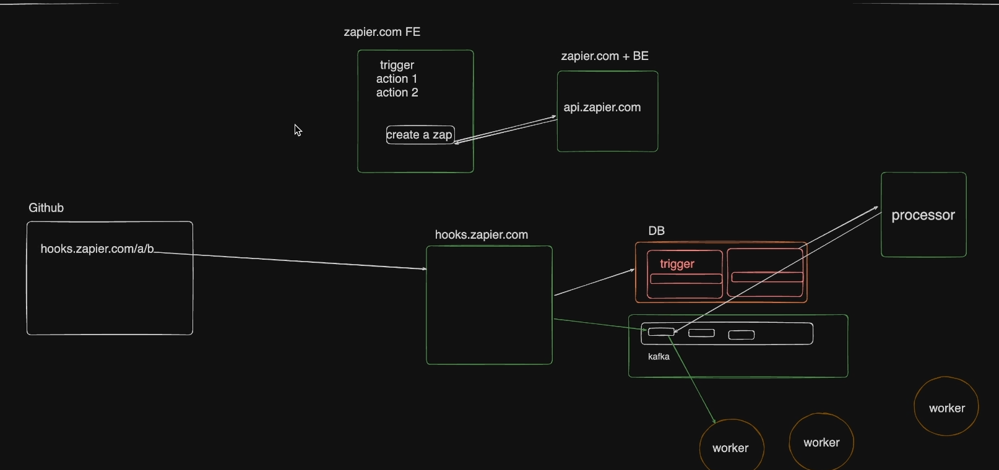
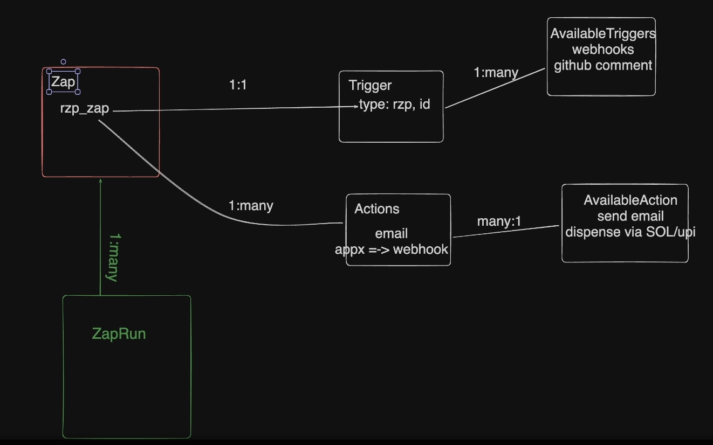

# <div> Linkr <div>
This project is a powerful automation platform, much like Zapier, designed for seamless integration and task automation. Built within a Turborepo setup, it offers modular and scalable architecture, enabling efficient scaling and code sharing across multiple services.


### Key Features
1. Scalable Architecture: Built for resilience and growth, utilizing the best of Node.js and Express for backend robustness.
2. Advanced Data Handling: Integrated with Kafka for message queuing, ensuring smooth and efficient handling of high-throughput tasks.
3. Database Flexibility: Uses PostgreSQL for reliable data storage, managed seamlessly with Prisma ORM.
4. Modern Frontend: Leverages Next.js for responsive, high-performing user interfaces.

## Architecture


#### Database Architecture



## Installation

Use the package manager [npm](https://www.npmjs.com/) to install dependency.

```bash
npm install
```

copy all .env.example to .env

Start Kafka and Postrgres locally docker

```bash
docker run -p 5432:5432 -e POSTGRES_PASSWORD=mysecretpassword  -d postgres
```
for kafka 

```bash
docker run -p 9092:9092 -d  apache/kafka:3.7.1  
```
create a event by exec in docker container in kafka of name  
```
zap-events
```

To start the repo go to prisma and genrate client 
```javascript
   cd packages/database 
```
Run 
```
npm run db:push
npm run db:generate
npm run db:seed
```
Finally to run 
```
npm run dev
```


## Contributing

Pull requests are welcome. For major changes, please open an issue first
to discuss what you would like to change.

Please make sure to update tests as appropriate.

## License

